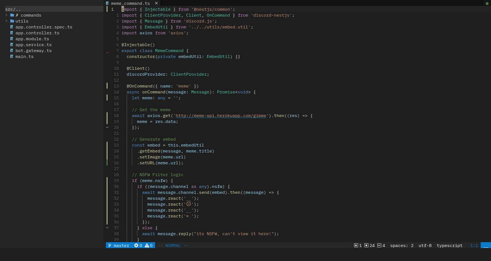

# Neovim

My neovim configuration, designed mainly for speed while keeping aesthetics in mind.

## Previews



## Details

- Package management: [packer.nvim](https://github.com/wbthomason/packer.nvim) 📦
- Start-up screen: [dashboard.nvim](https://github.com/glepnir/dashboard-nvim) 🎯
- Intellisense: [coc.nvim](https://github.com/neoclide/coc.nvim) 🧠
- Colorscheme: [Vscode.nvim](https://github.com/Mofiqul/vscode.nvim)
- Status bar: [lualine.nvim](https://github.com/nvim-lualine/lualine.nvim) ℹ
- Tabline: [bufferline.nvim](https://github.com/akinsho/bufferline.nvim) 📔
- File Navigation: [telescope.nvim](https://github.com/nvim-telescope/telescope.nvim) and [coc-explorer](https://github.com/weirongxu/coc-explorer) 📁
- Git: [gitsigns.nvim](https://github.com/lewis6991/gitsigns.nvim) 🎛

## Install

- Back up your previous neovim configuration:

```sh
$ mv ~/.config/nvim ~/.config/NVIM.BAK
```

- Install this config by cloning the repo to `~/.config/nvim`

```sh
$ git clone https://github.com/ParallaxWave/nvim ~/.config/nvim
```

- Setup [Packer.nvim](https://github.com/wbthomason/packer.nvim)
- After that, install the plugins from within nvim by running:

```
:PackerSync
```
