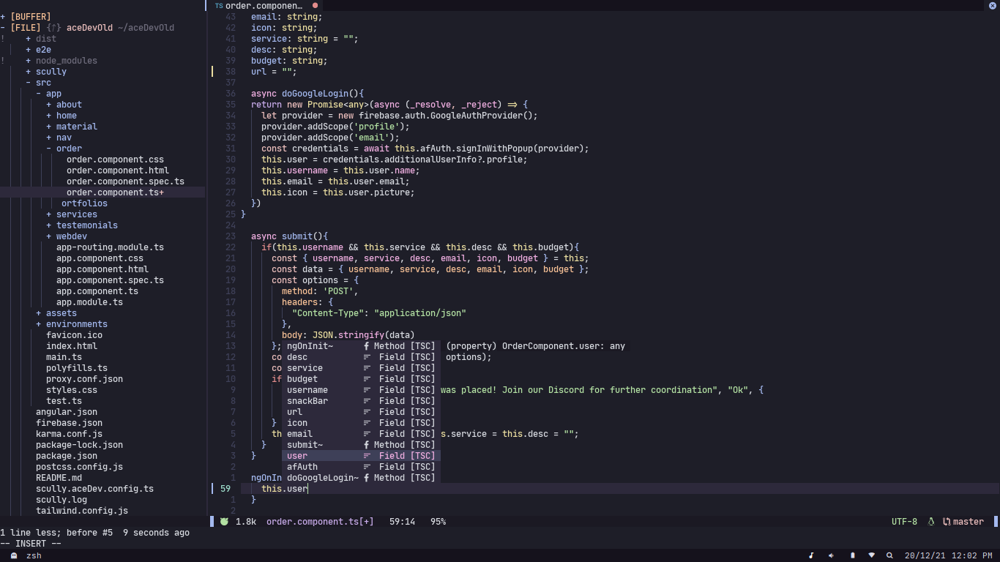

# Neovim
My neovim configuration, designed mainly for speed while keeping aesthetics in mind.
## Previews 



## Install
* Back up your previous neovim configuration: 
```sh
$ mv ~/.config/nvim ~/.config/NVIM.BAK
```

* Install this config by cloning the repo to ``~/.config/nvim``
```sh
$ git clone https://github.com/ParallaxWave/nvim ~/.config/nvim
```
* Setup [Packer.nvim](https://github.com/wbthomason/packer.nvim)
* After that, install the plugins from within nvim by running: 
```
:PackerSync 
```

